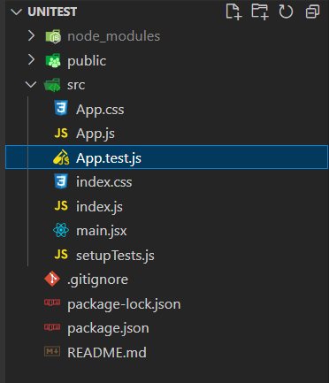
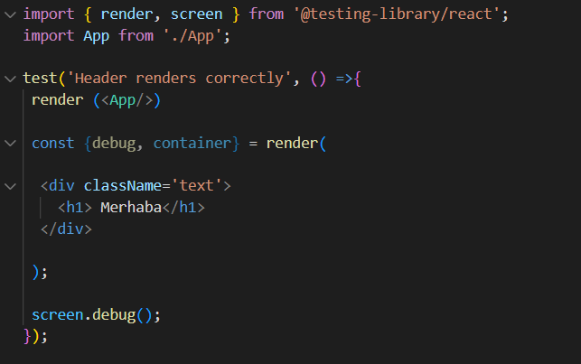
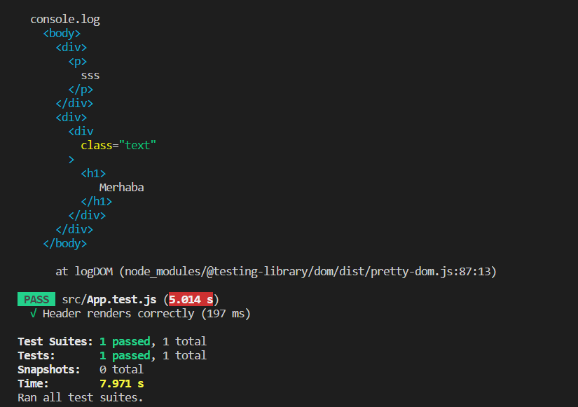
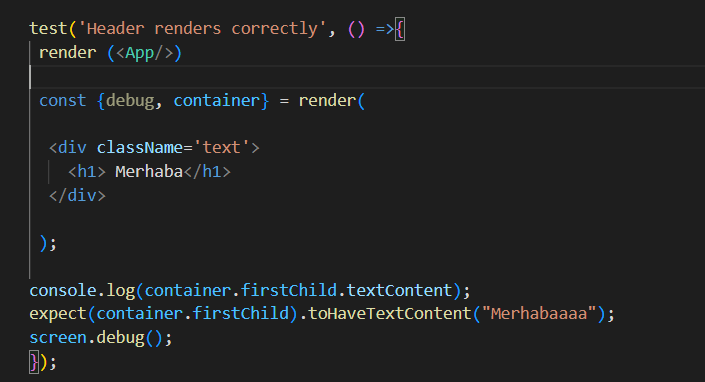
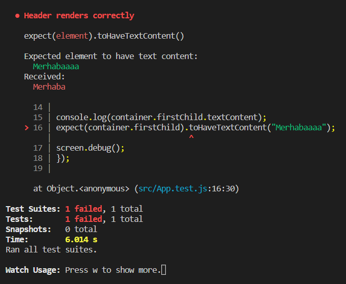
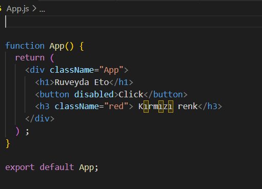
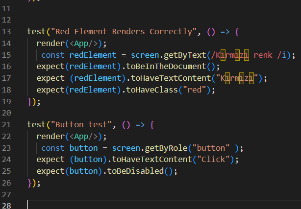
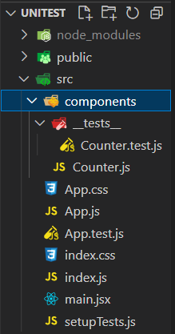
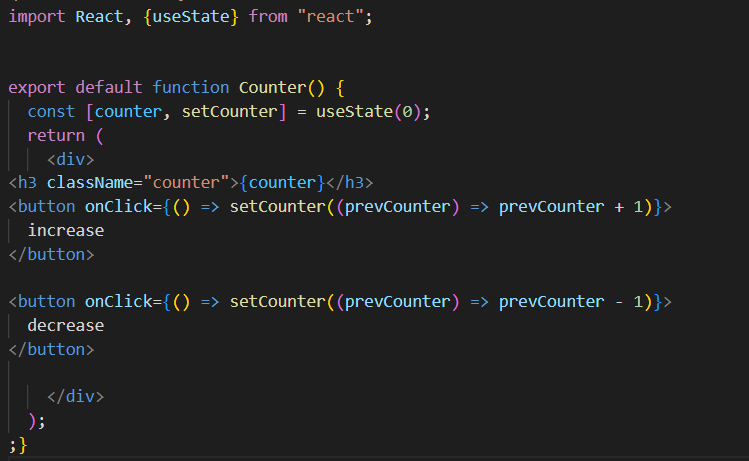
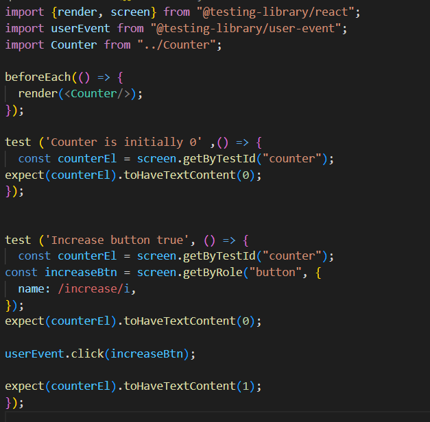

***REACT İLE UNİT TEST***

React componentlerini test edebilmek için https://testing-library.com/ kütüphanesini kullanacağım. Bu test kütüphanesi farklı framework ile uyumlu bir şekilde çalışabilir ancak örneklerde Jest ile gerçekleştirilmiş bir test örneği göreceğiz.

**NEDEN UNIT TESTLER YAZMAMIZ GEREKİYOR?**

Unit testler, bir yazılım projesinin kalitesini artırmak ve uzun vadede zaman kaybını önlemek için yazılması gereken bir yazılım geliştirme araçlarıdır.

Bir proje büyüdükçe uygulamadaki her senaryoyu test etmek zorlaşabilir ve bazı detaylar gözden kaçabilir. Tüm birimler doğru bir şekilde kontrol edilmezse en ufak değişiklik bile projede hatalara sebep olabilir.
Aslında iyi yazılmış bir unit teste dokümantasyon özelliği gözüyle bakabiliriz çünkü sonraki geliştiriclerin projeye dahil olma sürecini kolaylaştırarak devamlılığı sağlar.

React componentlerini test edebilmek için bir kütüphane kullanacağız."Testing Library" (https://testing-library.com/), bir yazılım test aracıdır. React, Vue, Angular gibi front-end teknolojileri kullanarak geliştirilen uygulamaların test edilmesine yardımcı olan bir kütüphanedir.
Bu kütüphanenin amacı, test yazma sürecini kolaylaştırmak ve testlerin daha anlamlı ve kullanıcı odaklı hale getirmektir. Kullanıcıların gerçek hayatta nasıl kullandığı gibi uygulamanızı test etmenizi sağlar.
Testing Library, Jest veya benzeri bir test framework'ü kullanarak yazılan testlerin daha anlamlı ve okunabilir hale getirilmesini amaçlar.
Dolayısıyla kullanıcının bir testi manuel olarak gerçekleştirmesi yerine unit testler yazılarak tek bir komutla gerçekleşmesi çok daha güvenilir ve hızlı olacaktır.

npm komutu ile bir react projesi oluşturduğumuzda proje dizininde bulunan App.test.js dosyasında geliştirmelerimizi yapacağız.

**SCREEN DEBUG CONTAINER**

***Screen Debug Methodu***

screen.debug yöntemi testlerinizi oluştururken bileşenlerin mevcut HTML çıktısını görmenizi sağlayan, React Testing Library'nin API'sindeki yararlı bir araçtır. Belirli öğelerin ortaya çıkan DOM çıktısını nasıl görüntüleyeceğimizi öğreneceğiz. Burada div içerisinde bulunan bileşeni DOM'a işledik ardından debug methodunu çalıştırdık. 
**npm run test** ile testimizi çalıştırdığımızda konsola aşağıdakiler kaydedilecektir.

Container içerisinde verilen class içerisine **firstChild** methoduyla ulaşabiliriz. 
Class'ın içeriğine ulaşabilmek için ise **toHaveTextContent** kullanabiliriz. 

**toHaveTextContent** methodu içerisine "merhaba" yazsaydık test başarılı olacaktı fakat farklı bir içerik yazdığımız için testimiz aşağıdaki gibi hata verecektir.

**DOM'A ERİŞMEK**

Şimdi App.js dosyamızın içeriğindeki class ismini ve içeriklerinin doğru olup olmadığını kontrol edelim. 

**getByText**: Aranan text ile eşleşen öğeyi bulmaya çalışır.

**toHaveTextContent**: bir Componentin belirli bir HTML elementine  render edildiğinin doğrulanmasını sağlar.

**toBeInTheDocument**: Componentin DOM'a eklenip eklenmediğini test eder.

**getByRole** : O metodun belirli bir rol için gerekli olan verileri doğru bir şekilde döndürüp döndürmediğini kontrol eder.

**toBeDisabled**: Bir HTML elementinin "disabled" özelliğinin beklenen değere uygun olup olmadığını kontrol etmek için kullanılan bir test metodudur. 

App.js dosyamızı test etmeye başlayalım.

****BeforeAll, BeforeEach, AfterAll, AfterEach****

**beforeEach** metodu, her test çalıştırılmadan önce çağrılır ve testin hazırlanmasına yardımcı olur.

**beforeAll** metodu ise, tüm testler çalıştırılmadan önce bir kez çağrılır ve testlerin hepsi için ortak bir hazırlık yapmasına olanak tanır.

**afterEach** metodu, her test çalıştırıldıktan sonra çağrılır ve testin sonrasında yapılması gereken temizlik işlemlerini yapmasına yardımcı olur.

**afterAll** metodu ise, tüm testler çalıştırıldıktan sonra bir kez çağrılır ve tüm testlerin sonrasında yapılması gereken temizlik işlemlerini yapmasına olanak tanır.

**cleanup** metodu, bir testin çalıştırılması sırasında oluşan verilerin temizlenmesine yardımcı olması amaçlı kullanılan bir Jest metodudur. Testler arasında paylaşılan verilerin silinmesi, yeniden çalıştırma veya diğer testlere etkilememesi için önemlidir. Bu metod, her testin sonunda çağrılabilir veya Jest tarafından sağlanan "afterEach" veya "afterAll" metodları ile de yapılabilir.

***USEREVENT YAPISI***

Bir components dosyası oluşturalım ve içerisine tüm componentleri ortak test edebileceğimiz bi bir test dosyası oluşturalım.

**userEvent** methodu, bir kullanıcının belirli bir olayı tetiklemesi durumunda uygulamanın nasıl davranacağını test etmek için kullanılan bir test fonksiyonudur.
Ardından yazdığımız sayaç uygulamasını **userEvent** methodunu kullanrak test edelim.

Şimdi göreceğimiz adımlar sayacınızın tıklama olayının düzgün şekilde çalışıp çalışmadığını test etmenize olanak tanır.

Her test için ayrı render yazmak istemediğimiz için **beforeEach** metohodunu kullandık. 

